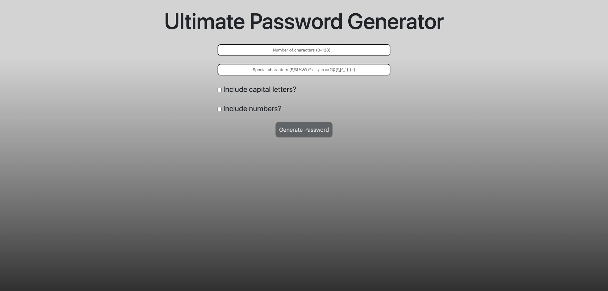
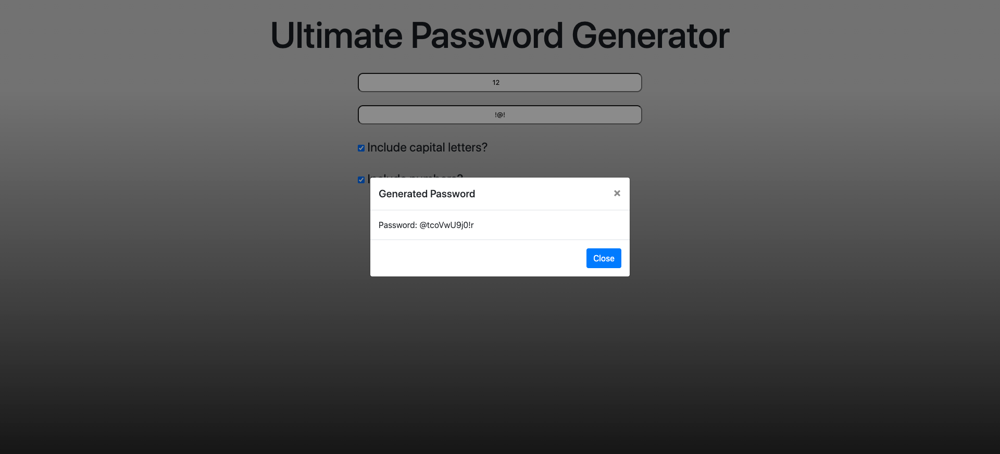
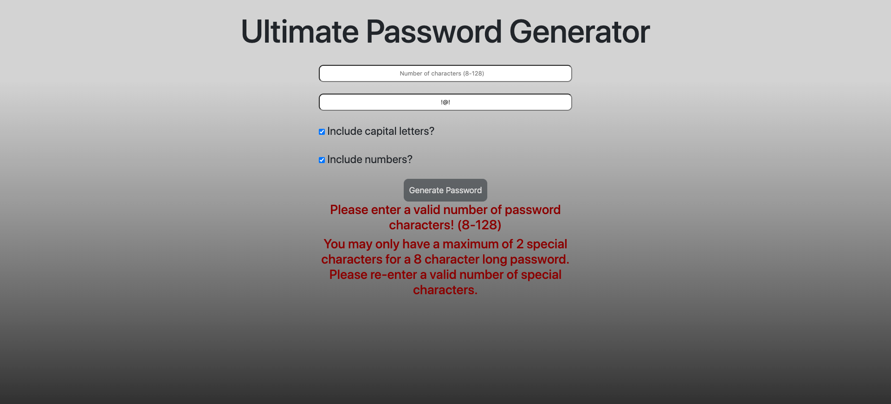

# Responsive Portfolio
This repository contains a unique password generator. It will allow the user to select how many characters they would like their password to be, if they desire special characters, if they want capital letters and if they want numbers. This then generates a unique password and displays it to the user with a prompt. The user may continue generating passwords if they do not like the password.

## Outline of Portfolio
This portfolio has many great features, which are outlined below:
1. Upon loading the page, input boxes, checkboxes and a generate button are loaded. The generate button is disabled until necessary information is entered.
2. The input box for password characters will validate the input and will keep the generate button disabled until a valid input (8-128) is input. If a valid input is entered, the generate button will be enabled.
3. The special characters input box allows users to add special characters. The amount of special characters they can add depends on how many characters the password length is (it is about 10% of the password length). If more than the allowed number are entered, the generate button will be disabled and a prompt will let the user know the maximum amount of special characters they can enter.
4. Even if the user enters non special characters into the special characters input box, a method will filter these out (this includes spaces).
5. There are two checkboxes to include capital letters and numbers. If checked, the program will include about 10% of the password length of the desired characters randomly into the password.
6. Upon selecting generate, the web page will generate a password with random characters, and then shuffle the order. This password is then displayed in a pop up for the user to copy and paste.
7. If they don't like their password, they can close the prompt and generate a new one. 

## Github links

[Homework-3 Github Repository](https://github.com/sean-marten/password-generator)

[Homework-3 Webpage](https://sean-marten.github.io/password-generator/src/index.html)

## Images of Webpages

The web page consists of a simple design. It has a faded gray background with two input boxes, two checkboxes and a button. The button produces a prompt, as shown below:

### Webpage at load:

### Generated password:

### Validation errors:

